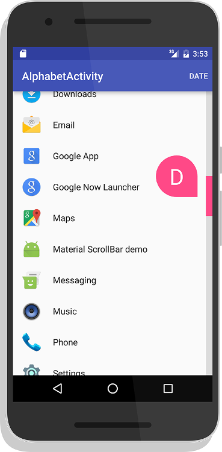

# MaterialScrollBar

[](http://www.apache.org/licenses/LICENSE-2.0) [](https://jitpack.io/#turing-tech/MaterialScrollBar) [](https://android-arsenal.com/api?level=7) [](https://android-arsenal.com/details/1/2441)

An Android library that brings the Material Design 5.1 scrollbar to pre-5.1 devices. Designed for Android's `recyclerView`.



[Video](https://youtu.be/F5glJeAFnA4)

[Image Preview](http://imgur.com/a/2SSeY)

[Google Play - Test Out the App](https://play.google.com/store/apps/details?id=com.turingtechnologies.materialscrollbardemo)

[Donate](https://www.paypal.com/cgi-bin/webscr?cmd=_s-xclick&hosted_button_id=UH23JHQ8K4U2C)

## Table of Contents
1. [Gradle](https://github.com/turing-tech/MaterialScrollBar#gradle)
2. [Documentation](https://github.com/turing-tech/MaterialScrollBar#documentation)
    1. [How to use](https://github.com/turing-tech/MaterialScrollBar#how-to-use)
    2. [My recyclerView elements aren't all the same size! What do I do?](https://github.com/turing-tech/MaterialScrollBar#my-recyclerview-elements-arent-all-the-same-size-what-do-i-do)
    3. [Indicators](https://github.com/turing-tech/MaterialScrollBar#indicators)
    4. [Specific Indicators](https://github.com/turing-tech/MaterialScrollBar#specific-indicators)
3. [License](https://github.com/turing-tech/MaterialScrollBar#license)

## Gradle

```gradle
allprojects {
    repositories {
        maven { url 'https://jitpack.io' }
    }
}
```

```gradle
dependencies {
    compile 'com.github.turing-tech:MaterialScrollBar:12.+'
}
```
## Documentation

Note: All customisation methods (`setAutoHide`, `setBarColor`, etc) return the `materialScrollBar`, so they can be chained together if wanted. Alternatively, you can just operate on a variable.

### How to use

The library comes in two flavours, drag and touch. Try both out to see which you prefer.

Option 1 - Drag

```xml
<com.turingtechnologies.materialscrollbar.DragScrollBar
    android:id="@+id/dragScrollBar"
    android:layout_width="wrap_content"
    app:msb_recyclerView="@id/recyclerView"
    app:msb_lightOnTouch="[[boolean]]"
    android:layout_height="match_parent" />
```

or

Option 2 - Touch

```xml
<com.turingtechnologies.materialscrollbar.TouchScrollBar
    android:id="@+id/touchScrollBar"
    android:layout_width="wrap_content"
    app:msb_recyclerView="@id/recyclerView"
    app:msb_lightOnTouch="[[boolean]]"
    android:layout_height="match_parent" />
```

Additonal optional attributes:

* msb_handleColor - Color
* msb_barColor - Color
* msb_handleOffColor - Color
* msb_textColor - Color
* msb_barThickness - Integer
* msb_rightToLeft - Boolean

Please note that for both of these configurations, both recyclerView and lightOnTouch* must have a valid value. The recyclerView attribute should point to the id of the `recyclerView` to which you want to link the scrollbar.

\* lightOnTouch behaves like this: A value of true will cause the handle to be grey until pressed, when it will become the normal accent color (as set). A value of false will cause the handle to always have the accent color, even when not being pressed.

------

### My recyclerView elements aren't all the same size! What do I do?

If you are in the situation of using headers of one size and elements of another, we've developed a solution speicifcally for you. Please follow the tutorial [here](https://github.com/krimin-killr21/MaterialScrollBar/wiki/Header-Tutorial).

If you are in some other situation where you're elements are differently sized, implement [ICustomScroller](https://github.com/turing-tech/MaterialScrollBar/blob/master/lib/src/main/java/com/turingtechnologies/materialscrollbar/ICustomScroller.java) in your adapter and complete the included methods.

------

### Indicators

To add an indicator, simply add the following line of code:

```java
scrollBar.setIndicator({{Indicator}}, {{addSpace}});
```

The indicator should be either `AlphatbetIndicator`, `DateAndTimeIndicator`, or `CustomIndicator`. See below for specific instructions per indicator.

`{{addSpace}}` is a boolean which indicates whether there should be space in between the indicator and the bar. True adds space, as in the latest version of the Google Launcher, while false adds no space, as in the Android 5.1 system scrollbars.

To use an indicator, you **MUST** make your `recyclerView`'s adapter implement the relevant interface. If you do not, the library will throw a runtime error informing you of your mistake. See documentation for the relevant interface.

------

### Specific Indicators
**AlphabetIndicator**

**Required Interface:** `INameableAdapter`

To implement an `AlphabetIndicator`, which displays one character usually corresponding to the first letter of each item, add the following to the end of your scroll bar instantiation, or add it as a seperate line.
```java
...setIndicator(new AlphabetIndicator(this));
```

**DateAndTimeIndicator**

**Required Interface:** `IDateableAdapter`

To implement a `DateAndTimeIndicator`, which displays any combination of time, day of the month, month, and year, add the following to the end of your scroll bar instantiation, or add it as a seperate line.
```java
...setIndicator(new DateAndTimeIndicator(this, {{includeYear}}, {{includeMonth}}, {{includeDay}}, {{includeTime}}));
```

All of the arguments are booleans (except for this first one obviously). The indicator will dynamically size, add punctuation, and localise for you. All you need to do is provide a `Date` object for each element in your adapter. You should almost always use miliseconds since the epoch unless you have a good reason not to. Otherwise, the library might crash.

**CustomIndicator**

**Required Interface:** `ICustomAdapter`

To implement a `CustomIndicator`, which displays any text you want, add the following to the end of your scroll bar instantiation, or add it as a seperate line.
```java
...setIndicator(new CustomIndicator(this));
```

## License

Material Scroll Bar:

    Copyright 2016-2017 Turing Technologies, an unincorporated orginisation of Wynne Plaga.

    Licensed under the Apache License, Version 2.0 (the "License");
    you may not use this file except in compliance with the License.
    You may obtain a copy of the License at

       http://www.apache.org/licenses/LICENSE-2.0

    Unless required by applicable law or agreed to in writing, software
    distributed under the License is distributed on an "AS IS" BASIS,
    WITHOUT WARRANTIES OR CONDITIONS OF ANY KIND, either express or implied.
    See the License for the specific language governing permissions and
    limitations under the License.

    This licensing is applicable to all code offered as part of this
    repository, which can be identified by the lisence notice preceding
    the content AND/OR by its inclusion in a package starting with "com.
    turingtechnologies.materialscrollbar".

RecyclerView-FastScroll:

     Copyright (C) 2016 Tim Malseed

    Licensed under the Apache License, Version 2.0 (the "License");
    you may not use this file except in compliance with the License.
    You may obtain a copy of the License at

       http://www.apache.org/licenses/LICENSE-2.0

    Unless required by applicable law or agreed to in writing, software
    distributed under the License is distributed on an "AS IS" BASIS,
    WITHOUT WARRANTIES OR CONDITIONS OF ANY KIND, either express or implied.
    See the License for the specific language governing permissions and
    limitations under the License.

Launcher 3:

     Copyright (C) 2010 The Android Open Source Project

    Licensed under the Apache License, Version 2.0 (the "License");
    you may not use this file except in compliance with the License.
    You may obtain a copy of the License at

       http://www.apache.org/licenses/LICENSE-2.0

    Unless required by applicable law or agreed to in writing, software
    distributed under the License is distributed on an "AS IS" BASIS,
    WITHOUT WARRANTIES OR CONDITIONS OF ANY KIND, either express or implied.
    See the License for the specific language governing permissions and
    limitations under the License.
